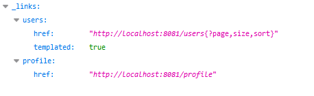

## Ejemplo 2: Usar un servidor REST local y ocupar los metodos GET, POST, PUT y DELETE

### Objetivos
* Hacer uso de otra API REST para el consumo de endpoints

### Prerequisitos
* Maven
* JDK 11
* Postman

### Procedimiento

1. Descargar el proyecto que actuara de servidor REST
2. Corremos el proyecto y para ver que esta corriendo entramos a la liga http://localhost:8081/ :

    

3. Crea el proyecto restMetodos2 con la dependencia de spring web y lombok
```java
    @Data
    public class User {

        private long id;	
        private String name;
        private String email;
        
        public User() {
            super();
        }
        
        public User(String name, String email) {
            this.name = name;
            this.email = email;
        }

        public User(long id, String name, String email) {
            super();
            this.id = id;
            this.name = name;
            this.email = email;
        }

    }
```
4. En la clase RestMetodos2Application adentro del metodo main colocamos el siguiente codigo:
```java
    RestTemplate restTemplate = new RestTemplate();
		
		//post
		restTemplate = new RestTemplate();
		HttpEntity<User> request2 = new HttpEntity<>(new User("Test", "test@test.com"));
		User user = restTemplate.postForObject("http://localhost:8081/users", request2, User.class);
	
		System.out.println("POST " + user);
		  
		//get
		restTemplate = new RestTemplate();
		user = restTemplate.getForObject("http://localhost:8081/users/1", User.class);
		  
		System.out.println("GET "+ user);
		//put
		restTemplate = new RestTemplate();
		request2 = new HttpEntity<>(new User(1,"Test put", "test@test.com"));
		HttpEntity<User> response2 = restTemplate.exchange("http://localhost:8081/users/1", HttpMethod.PUT ,request2, User.class);
	
		System.out.println("PUT " + response2.getBody());
		  
		//delete
		restTemplate.delete("http://localhost:8081/users/1");
```

5. Una vez terminado lo ejecutamos y vemos que nos imprime en consola el resultado


