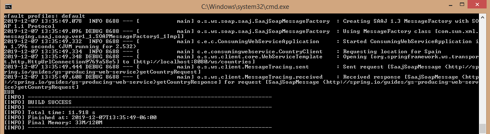

## Ejemplo 03: Consumo de un servicio web SOAP

### Objetivos
* Aprender la forma de realizar el consumo de un SOAP en Spring

### Prerequisitos
* Maven
* JDK 11

### Procedimiento

Nota: para este ejemplo ocuparemos los proyectos ejemplo que utiliza la pagina oficial de Spring par el [servidor](https://spring.io/guides/gs/producing-web-service/) y el siguiente para [cliente](https://spring.io/guides/gs/consuming-web-service/) 

1. Entrar a [Git](https://github.com/spring-guides/gs-soap-service.git) donde se encuentra el proyecto del servidor SOAP y clonarlo
2. Descomprimir el proyecto
3. Abrir el proyecto que se encuentra en la carpeta "complete" con su IDE preferido y compilarlo, otra opcion es compilarlo y correrlo con Maven:

    	mvnw spring-boot:run

4. Una vez corriento entramos a la siguinte url para ver que esta corriendo el servidor:

    	http://localhost:8080/ws/countries.wsdl

5. Entrar a [Git](https://github.com/spring-guides/gs-soap-service.git) donde se encuentra el proyecto del cliente y clonarlo

    	http://localhost:8181/index.html

6. Compilarlo y correrlo con Maven:

    	mvnw spring-boot:run

7. En la consola debe de mostrar el siguinte mensaje de "EUR":




Ya que el cliente esta construido para que imprima el currency de Spain

```java
    @SpringBootApplication
    public class ConsumingWebServiceApplication {

        public static void main(String[] args) {
            SpringApplication.run(ConsumingWebServiceApplication.class, args);
        }

        @Bean
        CommandLineRunner lookup(CountryClient quoteClient) {
            return args -> {
                String country = "Spain";

                if (args.length > 0) {
                    country = args[0];
                }
                GetCountryResponse response = quoteClient.getCountry(country);
                System.out.println(response.getCountry().getCurrency());
            };
        }

    }
```


