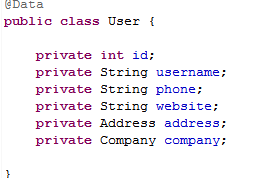
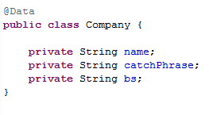
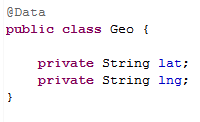
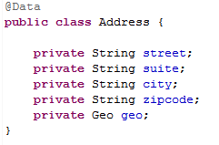
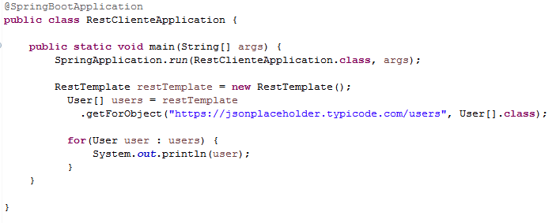

## Reto 1

### Objetivos
* Hacer un mapeo de un objeto anidado 

Crean un proyecto con spring-boot-starter-web y lombok de dependencias

Tendran que acceder a la liga https://jsonplaceholder.typicode.com/users el cual es el JSON que tendran que imprimir en consola, con la cual partiran para crear los atributos necesarios y objetos anidados que se muestran en el JSON.  

Colocar un forEach para que imprima la lista de users.

  
Solución

  <ol>
      <li>Creamos las siguientes clases: <li>
         
         
         
         
      <li>En el metodo main hacemos la peticion y imprimimos la lista de users</li>
         
      <li>Ejecutar el proyecto</li>
  </ol>

