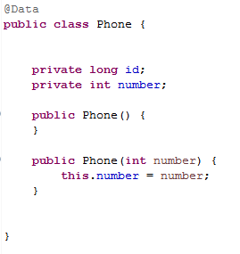
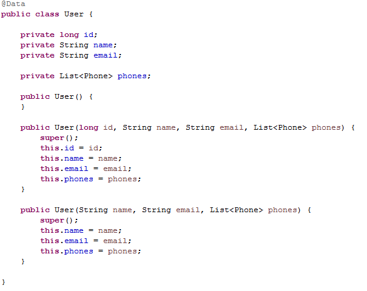
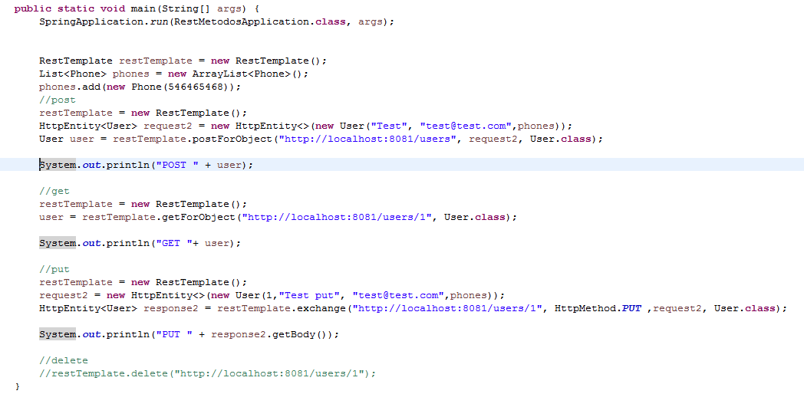

## Reto 2

### Objetivos
* Enviar en un metodo POST un JSON con un objeto anidado
* En el metodo GET mapear el objeto anidado

Descargar el nuevo servidor local que se ocupara en este reto

Corremos el proyecto y para ver que esta corriendo entramos a la liga http://localhost:8081/ :

Ocupar el proyecto del ejemplo 2 agregando una nueva clase llamada `Phone` el cual solo tendra el atributo "number" de tipo int.

Y la clase `User` debera tener un atributo de tipo lista de clase `Phone` y que se llame "phones".

Hacer las modificacion en el metodo main para que se envie junto con el user un phone o varios.

  
Solución

  <ol>
      <li>Creamos las siguiente clase: <li>
         
      <li>Modificamos la clase User: <li>
         
      <li>En el metodo main hacemos las modificaciones</li>
         
      <li>Ejecutar el proyecto</li>
  </ol>

