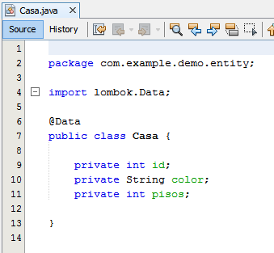
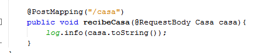

## Reto 2

### Objetivos
* Reafirmar el conocimiento de Spring boot

En el Ejercicio 2 partimos de un proyecto el cual recibe un Auto

En esta ocasión debemos colocar una nuevo metodo de tipo post y que reciba un objeto de tipo "Casa". 

Para esto creamos la clase con los siguientes atributos:

```java
    private int id;
    private String color;
    private int pisos;
```

En nuestro DemoController crear el metodo con la ruta "/casa" en el proyecto y que imprima el objeto.

<details>
  <summary>Solución</summary>

  <ol>
      <li>Agrega una nueva clase llamada Casa con la siguiente definición<li>
         
      <li>En DemoController agregamos el nuevo metodo</li>
         
      <li>Vuelve a ejecutar el proyecto</li>
  </ol>

</details>
