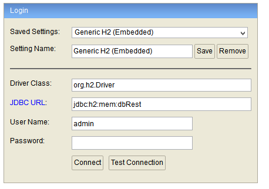

## Ejemplo 01: Usar MicroProfile para crear un microservicio

### Objetivos
* Crear los Endpoints basicos GET, POST, PUT y DELETE

### Prerequisitos
* Maven
* JDK 11

### Procedimiento

1. Descargar el proyecto llamado "rest" 
2. Abrir el proyecto con su IDE preferido
3. Agregamos la clase `AutorController` y colocamos la notación `@RestController` al principio de la clase.
4. Adentro de la clase colocamos el atributo `autorRepository` de tipo `autorRepository`.
5. Arriba de este atributo la notación `@Autowired`
6. Colocamos los siguientes metodos:

```java
    @GetMapping("/getAutor/{id}")
	public Autor getAutor(@PathVariable Long id) {
		return autorRepository.getOne(id);
	}
	
	@PostMapping("/saveAutor")
	public Autor saveAutor(@RequestBody Autor autor) {
		return autorRepository.save(autor);
	}
	
	@PutMapping("/updateAutor")
	public Autor updateAutor(@RequestBody Autor autor) {
		return autorRepository.save(autor);
	}
	
	@DeleteMapping("/deleteAutor/{id}")
	public void deleteAutor(@PathVariable Long id) {
		autorRepository.deleteById(id);
	}
```
7. Ejecutamos el proyecto y abrimos Postman para guardar un autor:

    

8. Accedemos a la base de datos http://localhost:8080/h2-console 

    

9. Hacemos una consulta a nuestra tabla Autor para ver el elemento guardado.

