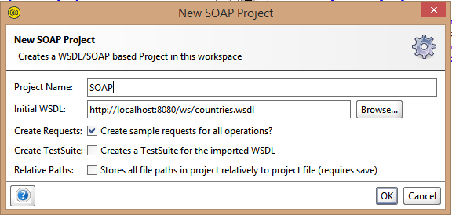
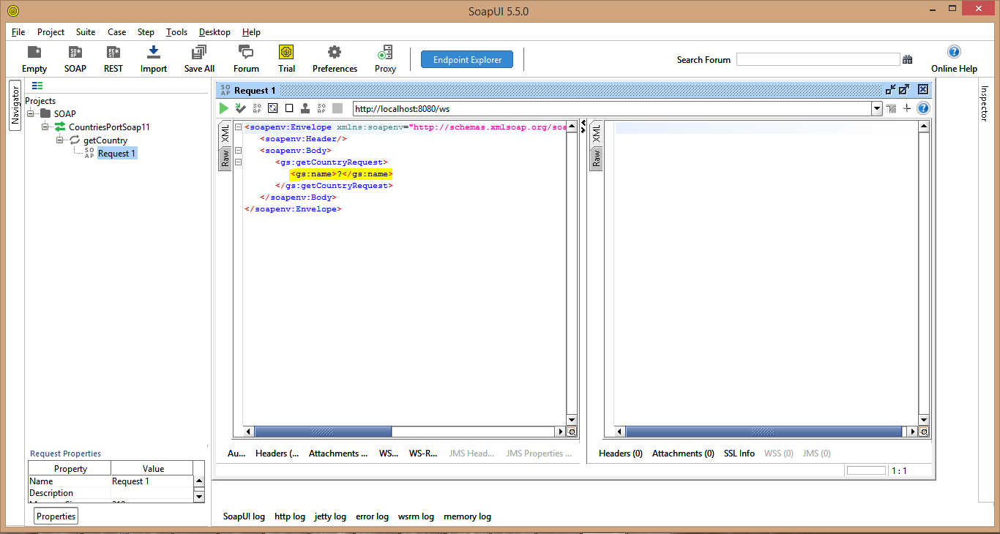
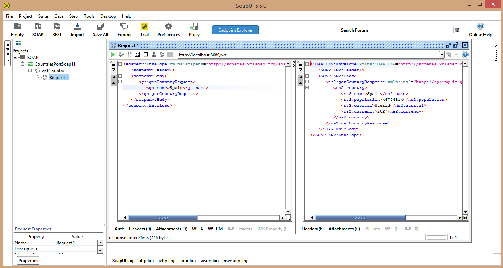

 ## Ejemplo 03: Consumo de un servicio SOAP

### Objetivos
* Aprender la manera de hacer un servicio SOAP en Spring y probarlo

### Prerequisitos
* Maven
* JDK 11
* SoapUI

### Procedimiento

Nota: para este ejemplo ocuparemos los proyectos ejemplo que utiliza la pagina oficial de Spring par el [servidor](https://spring.io/guides/gs/producing-web-service/)

1. Entrar a [Git](https://github.com/spring-guides/gs-soap-service.git) donde se encuentra el proyecto del servidor SOAP y clonarlo
2. Descomprimir el proyecto
3. Abrir el proyecto que se encuentra en la carpeta "complete" con su IDE preferido y compilarlo, otra opcion es compilarlo y correrlo con Maven:

    mvnw spring-boot:run

4. Una vez corriento entramos a la siguinte url para ver que esta corriendo el servidor:

    http://localhost:8080/ws/countries.wsdl

5. Abrimos SoapUI y seleccionamos la opcion SOAP y colocamos la informacion que aparece en la imagen:

    

6. Seleccionamos el signo de + que se encuentra a lado de getCountry y le damos click a la opcion Request1 y nos aparecea lo siguiente:

    

7. Sustituimos el signo de ? y colocamos Spain y despues le damos click al boton play y nos devolvera lo siguiente:

    

