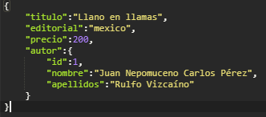

## Reto 1

### Objetivos
* Crear los endpoints de GET, POST, PUT y DELETE para el repository LibroRepository

Continuar con el proyecto del ejemplo 1 y crear la clase `LibrosController` junto con sus metodos

No olviden que al guardar un libro en el JSON debe de venir tambien el objeto de un Autor para que haga la relacion en la base de datos.

  
Solución

  <ol>
      <li>Creamos la clase `LibrosController`<li>
      <li>Agregamos el atributo de LibrosRepository y lo inyectamos</li>
      <li>Creamos los Endpoints</li>
      <li>Ejecutamos el programa y guardamos primero un autor y despues agregamos un libro como se muestra en la imagen</li>
       
  </ol>

