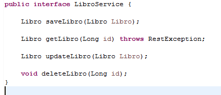
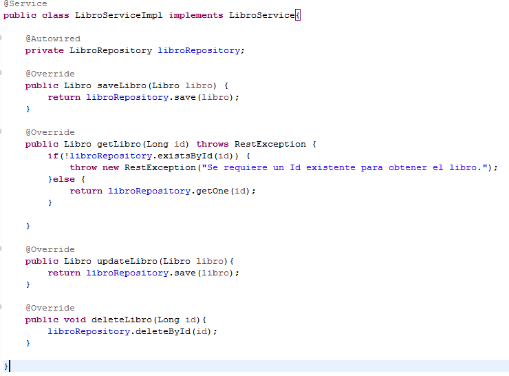
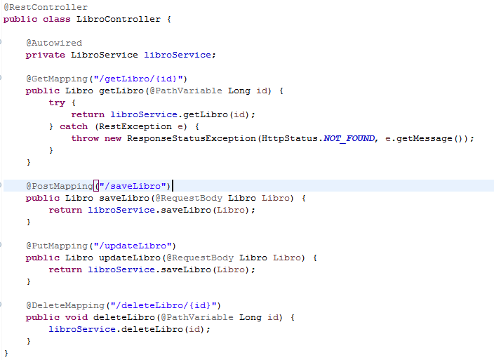

## Reto 2

### Objetivos
* Agregar los cambios que se hicieron en AutorController a LibroController

Continuamos con el Ejemplo 2

Habra que crear la interfaz `LibroService` y la clase `LibroServiceImpl` y que implemente los metodos de `LibroService` parecidos a los que se hicieron en `AutorService`

Y editar la clase `LibroController`

  
Solución

  <ol>
      <li>Creamos la interfaz LibroService con los siguientes metodos<li>
         
      <li>Implemetamos los metodos en la clase LibroServiceImpl</li>
         
      <li>Hacemos los cambios en LibroController</li>
         
  </ol>

