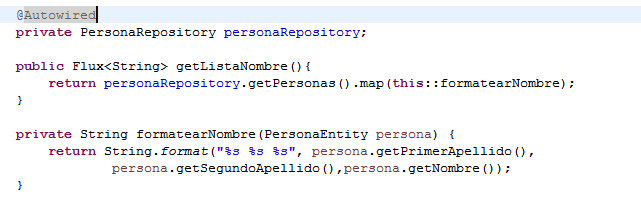
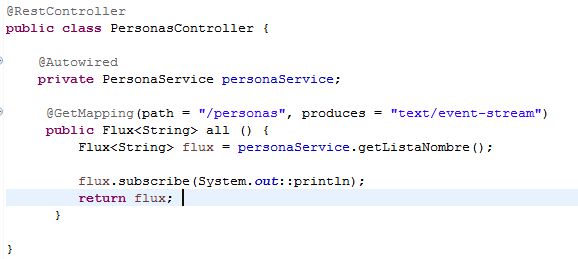

## Reto 1

### Objetivos
* Crear un endpoint que devuelva los nombre concatenados

Descargar el proyecto que se tiene en el reto

Completar la clase persona `PersonaService`, crear un metodo que concatene los atributos `primerApellido`, `segundoApellido` y `nombre` de la clase `PersonaEntity`

Crear la clase `PersonaController` y crear un endpoint que se llame "/personas" y llame el metodo de `PersonaService`

  
Solución

  <ol>
      <li>Completamos la clase PersonaService <li>
         
      <li>Creamos la clase PersonaController</li>
        
  </ol>

