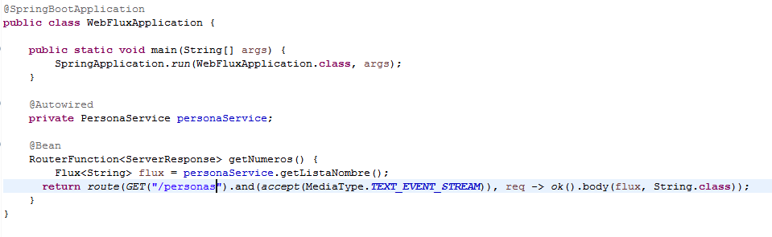

## Reto 2

### Objetivos
* Crear un endpoint de la forma Function Endpoint

Descargar el proyecto que se tiene en el reto

Modificar el proyecto del reto 1, eliminar el Controller y crear el Bean con la function Endpoint lo que hicimos en el controller

  
Solución

  <ol>
      <li>Completamos la clase PersonaService <li>
         
  </ol>

