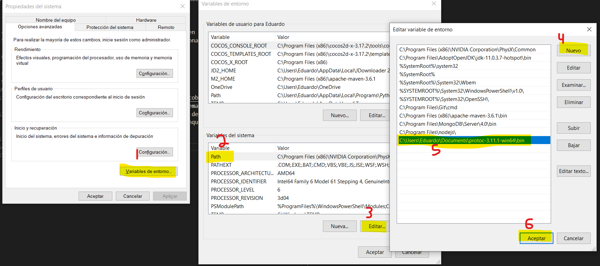

## Ejemplo 1: 

### Objetivo
- Conocer los archivos .proto para la serialización en Protocol Buffers
- Relacionarse y conocer las características y funcionalidades de los archivos .proto
---

### Requisitos
- JDK 8 (o superior)
---

### Desarrollo
1. [Descargar](https://github.com/protocolbuffers/protobuf/releases/tag/v3.11.1) protoc (compilador proto) según sea su sistema operativo.
2. Agregar al las variables del sistema protoc (Si se desea no ejecutar desde la misma carpeta y especificar la carpeta origen, aunque este paso no es 100% necesario):

* windows


* linux:
```
export PATH="/path/to/proto:$PATH"
~/.bashrc
```

3. Verificar proto en un powershell/cmd/terminal:

Ejecutar la instrucción: `protoc --version`. 

Esto debería devolver: `libprotoc 3.11.1`

4. Crear un Archivo llamado `user.proto` con la siguiente estructura:

```
syntax = "proto2";

package org.bedu.ejemplo01.protos;

option java_package = "org.bedu.ejemplo01.protos.models";
option java_outer_classname = "UserProto";

message User {
  required string name = 1;
  required int32 id = 2;
  required string email = 3;
  required string password = 4;

  enum Gender {
    MALE = 0;
    FEMALE = 1;
  }
    
}
```

* la primera línea especifica la sintaxis del archivo (versión 2 o 3 de proto).
* La segunda especifica el paquete para evitar conflictos entre proyectos (hablando de los archivos proto).
* seguido, `option java_package` especifica en cuál paquete irán las clases generadas.
* `option java_outer_classname` define la clase que contiene todos los mensajes y declaraciones de este archivo `proto` (Esta será la clase compilada).
* Los valores (marcadores) asignados a los campos, son en realidad un tag que los campos utilizan en la codificación binaria. Del 1-15 requieren un byte menos para codificarse (contra valores mayores). Esto es útil en temas de optimización.

5. Mover este archivo a un paquete lamado `protos`.

Ejecutar:

```bash
 protoc --java_out="origen_codigo_java" --proto_path="path_destino_clases_generadas" 'path_de_archivo.proto'
```

Por ejemplo, dado la estructura del proyecto y suponiendo que el está en el escritorio, la compilación se realizaría de la siguiente manera:

```bash
protoc --java_out="C:\Users\mi-usuario\Desktop\05 Protocol Buffers\ejemplo01\ejemplo01\src\main\java" --proto_path="C:\Users\mi-usuario\Desktop\05 Protocol Buffers\ejemplo01\ejemplo01\src\main\java" 'C:\Users\mi-usuario\Desktop\05 Protocol Buffers\ejemplo01\ejemplo01\src\main\java\org\bedu\ejemplo01\protos\user.proto'
```

Notar que cada directorio es separado por un espacio.

Si se observa el resultado, ahora existe un paquete `models.protos` y este contiene la clase compilada `UserProto.java` (Tal y como lo especificamos en el archivo .proto)
