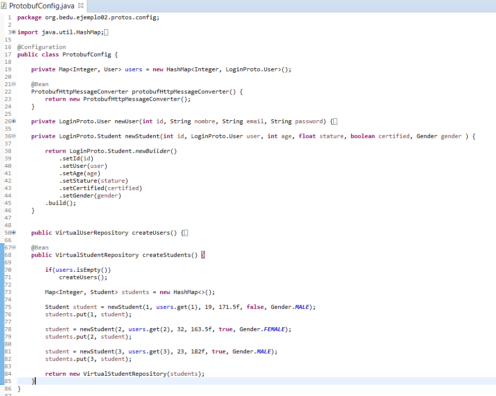
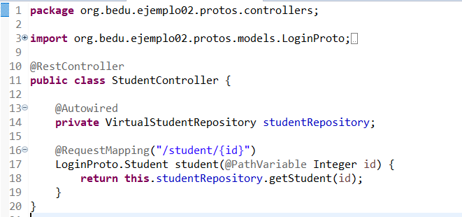
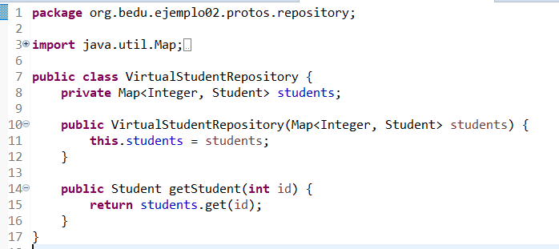

## Reto 2: 

### Objetivo
- Poner a prueba conceptos de uso de Spring con protocol Buffers
---

### Requisitos
- ejemplo02
---

### Desarrollo
1. A partir del ejemplo02, crea las clases (Repositorio/controladores) y modifica las clases necesarias para poder obtener datos del message Student del archivo `.proto`

  
Solución

  Se propone el siguiente código:
  <ul>
      <li><li>
      <li></li>
      <li></li>
  </ul>

