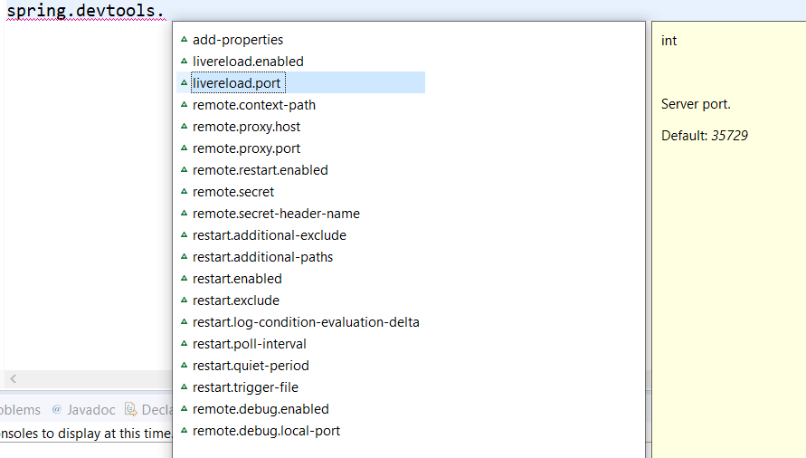
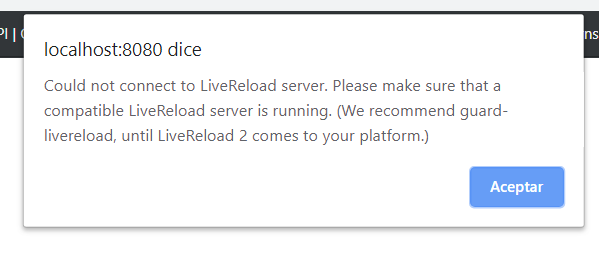

## Ejemplo 3: Propiedades por defecto de Spring DevTools

### Objetivos
- Conocer las propiedades por defecto de Spring Dev Tools
- Aprender a configurar propiedades de desarrollo de manera global (para todos los proyectos Spring boot)
- Conocer utilidades de desarrollo y producción


### Requisitos
- Ninguno

Spring dev tools tiene una serie de propiedades muy comunes preconfiguradas  por defecto que nos ayudan en el proceso de desarrollo:



Podemos sobre-escribir cualquier propiedad que se requiera, cada una de estas depende de la intención que tengamos.

Esto lo podemos hacer en cada archivo de configuración (`.properties` o `.yaml`) pero quizá una mejor manera sea aplicar estos cambios de manera global, es decir para todos nuestros proyectos:

1. Si es necesario (no existe), crea un directorio llamado `config` dentro de tu $HOME (usuario personal).

2. dentro del directorio anterior, crea otro llamado `spring-boot`.

3. finalmente dentro de este crea un archivo lamado `spring-boot-devtools.properties` (o el formatos que se use `yaml/yml`).

Este archivo permitirá modificar las propiedades de manera que apliquen a todos los proyectos de spring boot.

Por ejemplo, si deseamos pausar por un tiempo la Spring Dev Tools:

```
spring.devtools.restart.enabled=false
```

Esto causará que no se recompile el proyecto cada vez que guardemos, por lo tanto tampoco se aplicará el live reload. Si solo queremos que no se aplique el live reload, entonces usamos la siguiente configuración:

```
spring.devtools.livereload.enabled=false
```

Si damos click en la extensión del navegador para intentar la recarga automática, obtendremos un mensaje como el siguiente:


