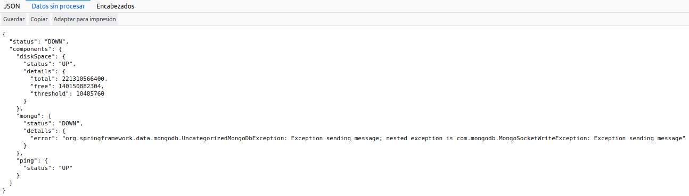

## Respuesta postwork sesión 7: 

- ¿Cuál puede ser el problema?
```
Dada la cantidad de inserciones que se hicieron, el problema puede ser la base de datos
```
- ¿Cómo podrías verificar el problema?

```
Dado que se tiene actuator, se puede verificar que la base de datos esté funcionando correctamente.
```

Si se navega al endpoint `/actuator/health` se podría verificar la base de datos, suponiendo el problema actual, aparecería algo como lo siguiente:



- ¿Cómo se soluciona el problema?


```
Reiniciando la base de datos, asignando más espacio, etc (el problema está relacionado con la base de datos no con el código).
```